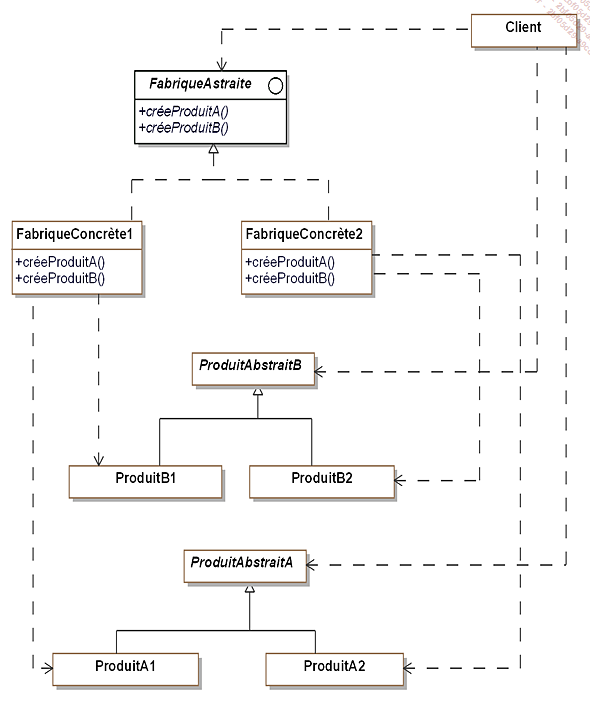

# Abstract Factory
- Interface
- Sous classe
    - Implemente les interfaces
    - Description des methodes

### Scooter
- Classe abstaite
- `ScooterElectricité` et `ScooterEssence` héritent de Scooter

### Exemple Général

- `ProduitAbstraitA` et `ProduitAbstraitA` correspondent respectivement aux classent abstraitent `Automobile` et `Scooter`
- `ProduitA1`, `ProduitA2`, `ProduitB1`, `ProduitB2` correspondent respectivement à `AutomobileEletricité`, `AutomobileEssence` , `ScooterElectricité`, `ScooterEssence`
