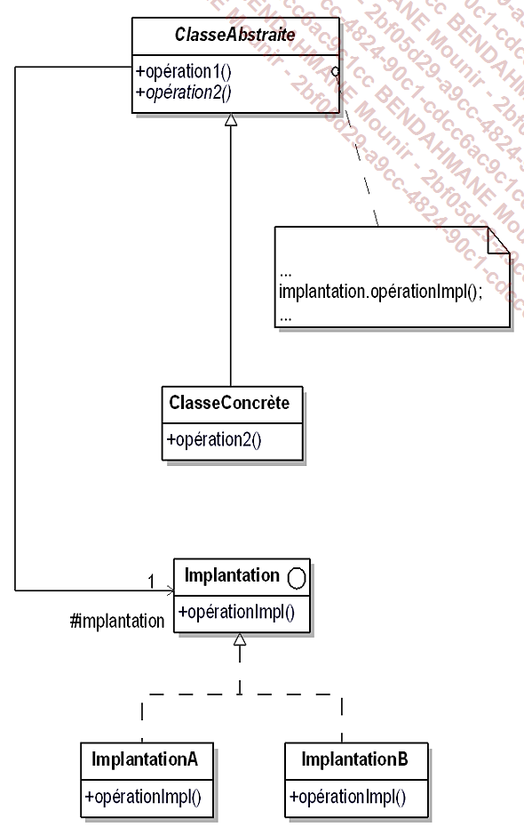
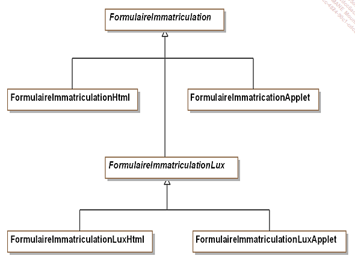

# Bridge
Le pattern bridge est utilisé pour séparer le comportement de l'implementation de l'interface et de l'implémentation de l'objet.  
On s'intéresse au demande d'immatriculation des 

Le formulaire de demande d'immatriculation `FormulaireImmat` possède deux implémentations différentes
- FormulaireImmatHTML
- FormulaireImattAPP  

Au départ le système à été conçu pour la France uniquement.
Ensuite on a du créé une sous-classe `FormulaireImmatCH`.  
Elle aussi abstraite pour avoir également deux sous-classes concrètes (`FormulaireImmatHTML`, `FormulaireImattAPP` dédiées à la Suisse)

### Exemple Général

### Exemple Concret

La classe abstaite `FormulaireImmatriculation` implemente l'interface `FormulaireImpl` 