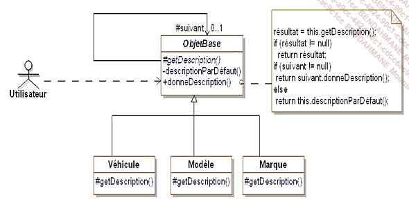

# Les patterns de Comportement
Les patterns de comportement distribuent les algorithmes/traitements entre les objets.  
Ils organisent les interactions en renseignant le "flux de controle" et de traitement au 
sein d'un système d'objets.  
La distribution se fait soit par héritage, soit par délégation.  

# Chain Of Responsability
Le but du pattern Chain Of Responsability est de construire une chaine d'objets de manière 
à ce que si un objet de la chaine ne peut répondre à une requête, 
il puisse la passer à un "successeur" et ainsi de suite jusqu'à ce que l'un des objets puissent 
y répondre.

### Exemple Général

### Exemple Concret

