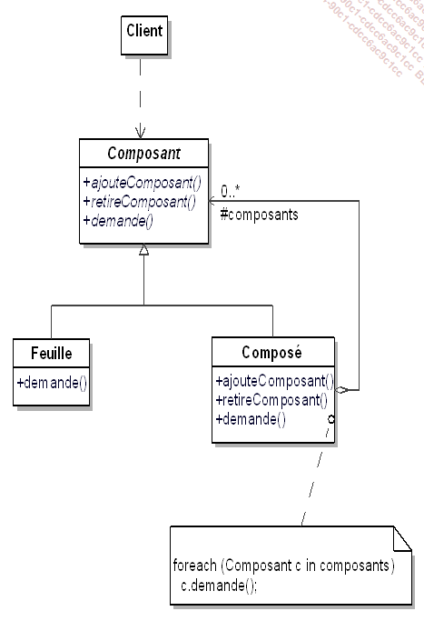

# Composite
Ce pattern offre un cadre de conception d'objet dont on ne connait pas la profondeur.  
On peut utiliser un arbre en tant qu'analogie.  
Les "Clients" interagissent avec les objets sans connaitre la structure de l'arbre.

### Exemple Général

### Exemple Concret

