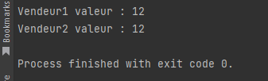

# Singleton
- Le pattern est utilisé pour créer une instance unique d'une classe
- Le pattern abstract est susceptible d'utiliser le singleton
### Exemple Général

### Exemple Concret

- Notre application va utiliser la classe liase vierge qui ne possédera qu'une seule instance.
- Chaque classe qui utilise la liasse vierge doit avoir accès a la meme instance. On doit surtout s'arranger pour qu'on ne puisse pas en créer de nouvelles (avec l'opérateur new)

```csharp
public sealed class Vendeur
{
    private Vendeur()
    {
    }
    private static Vendeur _instance = null;
    public int TotalSales { get; set; }
    public static Vendeur Instance()
    {
        if(null == _instance)
        {
            _instance = new Vendeur();
        }
        return _instance;
    }
}

public class Program
{
    static void Main(string[] args)
    {
        Vendeur vendeur1 = Vendeur.Instance();
        vendeur1.TotalSales = 12;
        Console.WriteLine("Vendeur1 valeur : " + vendeur1.TotalSales);
        Vendeur vendeur2 = Vendeur.Instance();
        Console.WriteLine("Vendeur2 valeur : " + vendeur2.TotalSales);
        if (vendeur1 == vendeur2)
        {
            Console.WriteLine("Il y a bien qu'une seule instance");
        }
    }
}
```
